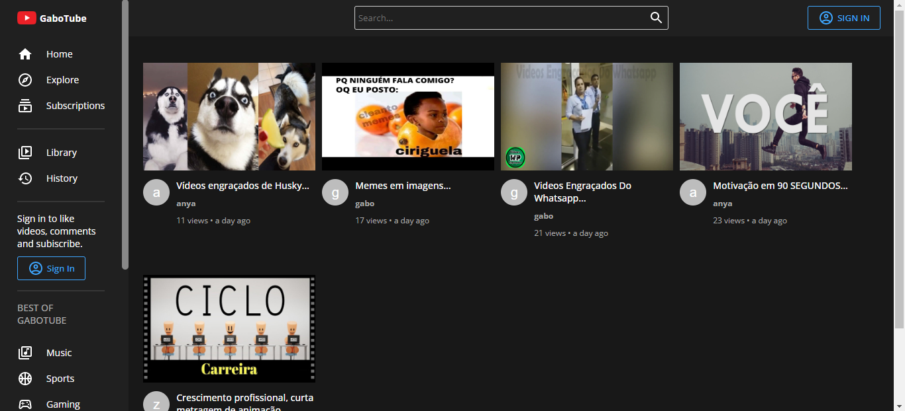

# Sharing Video

> Aplicação web para o compartilhamento e visualização de vídeos.

## ☕ Usando Sharing Video

Para usar Sharing Video, clique no link abaixo:

[![Link]](https://sharing-video-mern.web.app/)

## 💻 Tecnologias

As tecnologias utilizadas para construir o Sharing Video foram:

- JavaScript
- React
- Redux Toolkit
- Node
- Express
- MongoDB
- Material UI
- Styled Components
- Firebase

## 🤝 Colaborador

Agradecemos à seguinte pessoa que contribuíu para este projeto:

<table>
  <tr>
    <td align="center">
      <a href="https://github.com/gabomoreira">
         
        
          <b>Gabriel Moreira</b>
        
      </a>
    </td>
  </tr>
</table>
